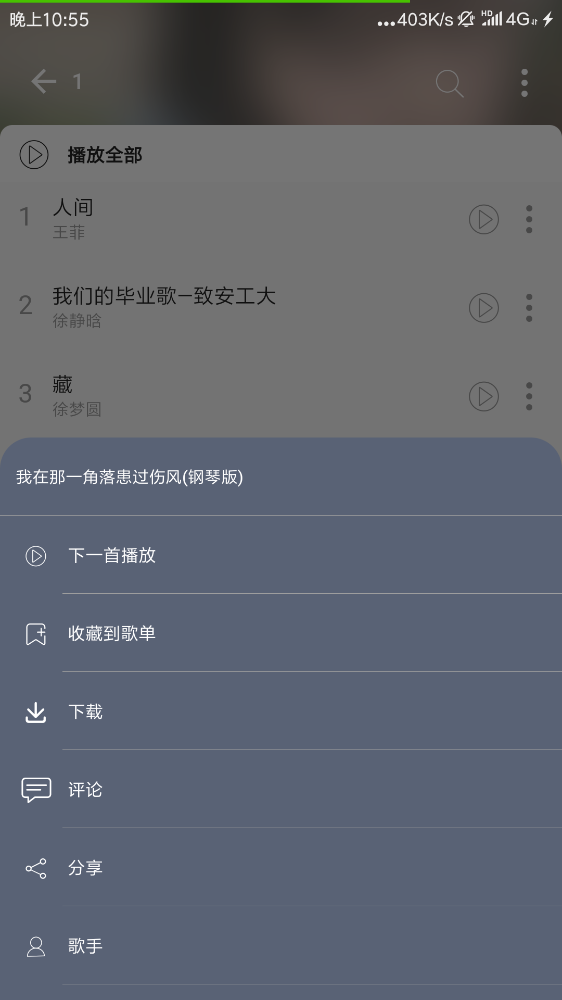
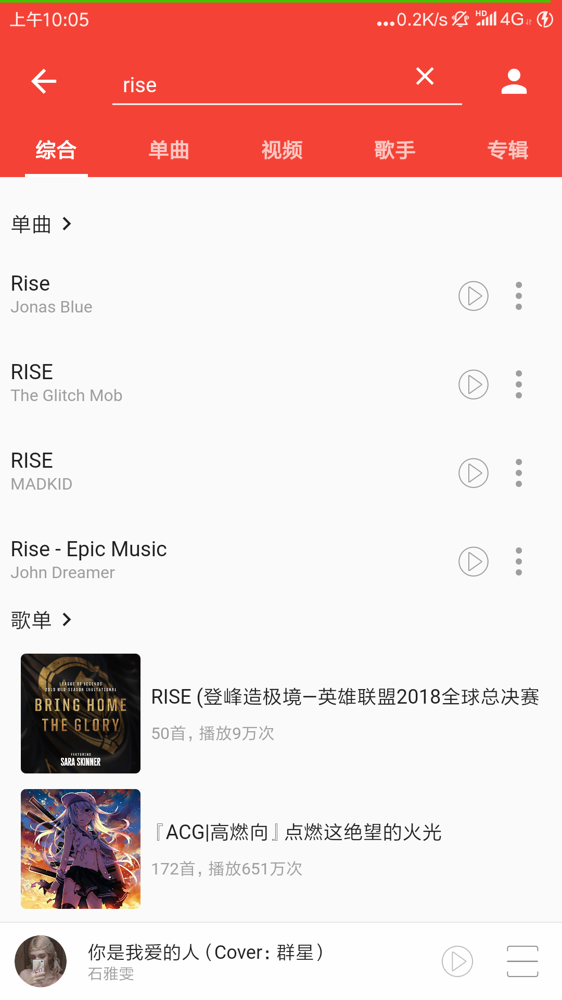
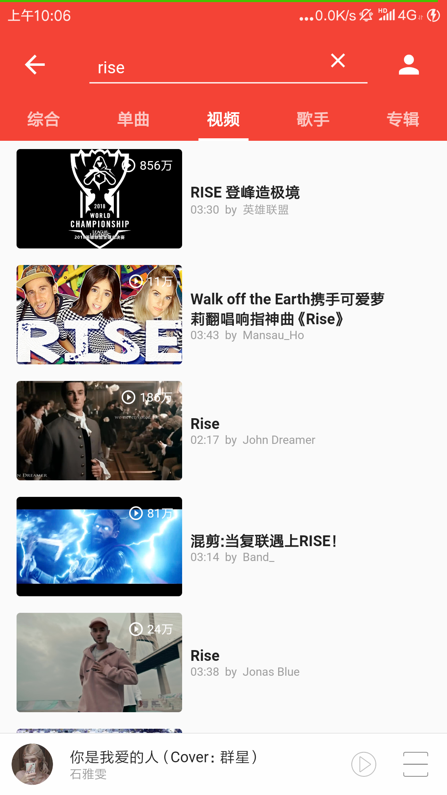

# music

## 当前项目已经完成的功能：

- splah页面
- 登录
- 播放音乐
- 显示歌词
- 歌词跟随
- 上一曲/下一曲
- 搜索
- 搜索提示
- 播放mv/video
- 用户中心
- 评论页(歌单和歌曲)--歌单页点击播放相似歌曲，播放当前评论歌曲
- 在歌单中指定下一曲播放歌曲

## 接下来要完成的功能

- 评论（带emoji表情的）
- 设置皮肤
- 动态展示

---

## 嘤嘤嘤

项目写了有接近一个月了，进度很慢，很多东西都是在实践中学习，一点一点来的.....

好可惜啊，界面还没有写完，网易的界面就更新了

---
### 项目难点与问题解决

#### 1.安卓9无法播放音乐的问题：
    无法在Android 9上播放远程文件：Android 9已经更改了一些网络安全默认值，因此默认情况下它可能会阻止您播放https以外的文件，此stackoverflow问题是解决此问题的良好来源。
解决方法：
    在android/app/src/main/AndroidManifest.xml文件中添加：android:usesCleartextTraffic="true"

    <manifest ...>
        <uses-permission android:name="android.permission.INTERNET" />
        <application
            ...
            android:usesCleartextTraffic="true"
            ...>
            ...
        </application>
    </manifest>

#### 2.使用高斯模糊：
    使用高斯模糊时，背景层全屏模糊
    解决办法：
        在BackdropFilter组件的外层包裹ClipRect，
        详细使用请参考文件：lib/views/songList/header.dart

#### 3.二级导航栏联动：
    到tabview中嵌套tabBar-tabview时，二级目录是不能滑动到一级目录去的，
此时就要借助插件：<a href="https://pub.flutter-io.cn/packages?q=extended_tabs"  target="_blank" >extended_tabs</a>
    使用文档：[文档](https://juejin.im/post/5c34b87ef265da61553b01a8)

#### 4.状态管理：
    状态管理使用的provide，现在谷歌已经公开宣布放弃了，并推荐使用provider，项目已经写差不多了，我也没改了，
    

下面放上截图：
## 6.4更新  添加showModalBottomSheet,并把部分函数抽离，上图：

## 6.2更新  歌曲评论和歌单评论

## 5.30更新

## 5.15更新
## 增加了搜索的数据管理结构，界面还没开始写，手写了搜索推荐的局部dialog，上图吧，

局部dialog，嘿嘿，我觉得写得蛮不错的，

## 5.4更新
-------------------------
## 动图来了，这次更新了很多
## 进入app时的splash屏闪页、进入登录页面的动画，登录提示

## Home页相关：歌单点击动画、drawer、二级导航联动

## 歌单相关：歌单展示和歌单Header折叠

## 用户中心相关：用户信息展示、header折叠

## 歌曲播放页面：点歌、在播放页面点下一曲和上一曲

## 播放和暂停

## 歌词跟随，歌词可以跟随进度条改动而调整，可以拉动查看歌词

## 第一屏   登录 home页面 Drower页面

## home页面的第二个页面

这里使用了extended_tabs插件，来解决二级导航滑动的问题，，，，，

相信写过的小伙伴知道我说的二级导航滑动的问题，这里当初自己写写了好久，我哭了.......

## 一级导航的第二页 一级导航的第二页中的第二页 个人中心

# 给我一点时间----------

# 我一定会努力的！！！！

