# music

## 嘤嘤嘤

项目写了有接近一个月了，进度很慢，很多东西都是在实践中学习，一点一点来的.....

好可惜啊，界面还没有写完，网易的界面就更新了

下面放上截图吧：

# 5.4更新
-------------------------
## 动图来了，这次更新了很多
## 进入app时的splash屏闪页、进入登录页面的动画，登录提示

## Home页相关：歌单点击动画、drawer、二级导航联动

## 歌单相关：歌单展示和歌单Header折叠

## 用户中心相关：用户信息展示、header折叠

## 歌曲播放页面：点歌、在播放页面点下一曲和上一曲

## 播放和暂停

## 歌词跟随，歌词可以跟随进度条改动而调整，可以拉动查看歌词

## 第一屏   登录 home页面 Drower页面

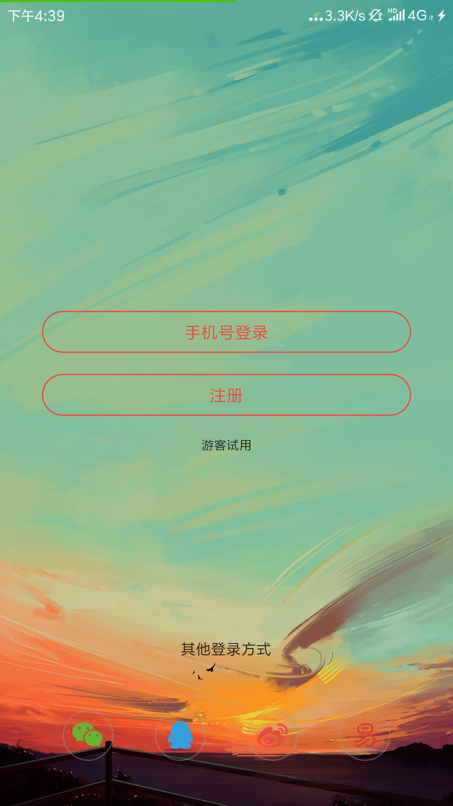
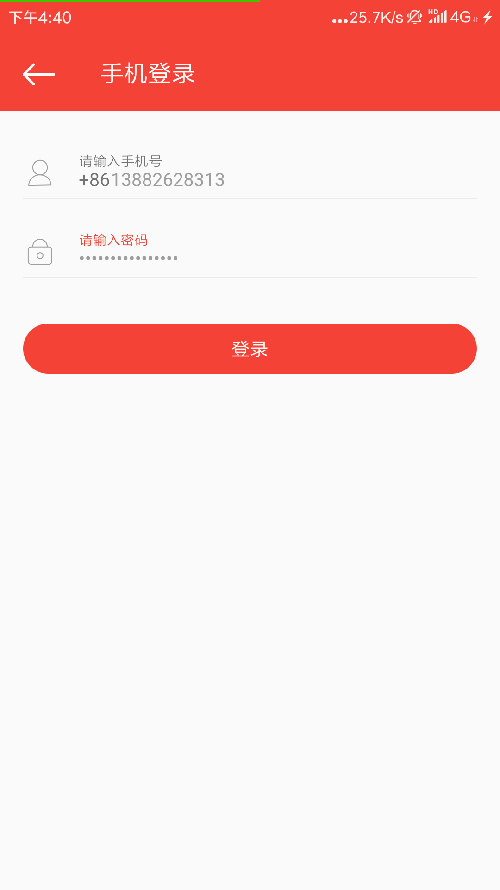
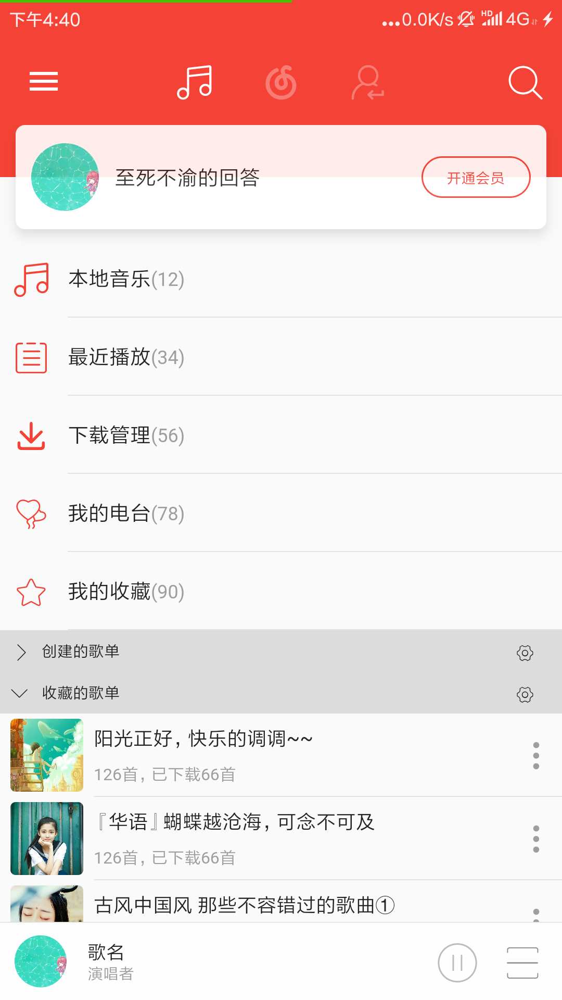
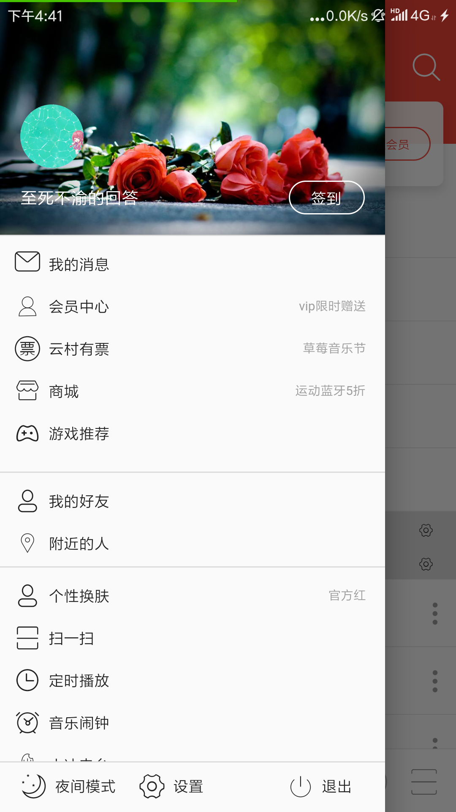

## home页面的第二个页面

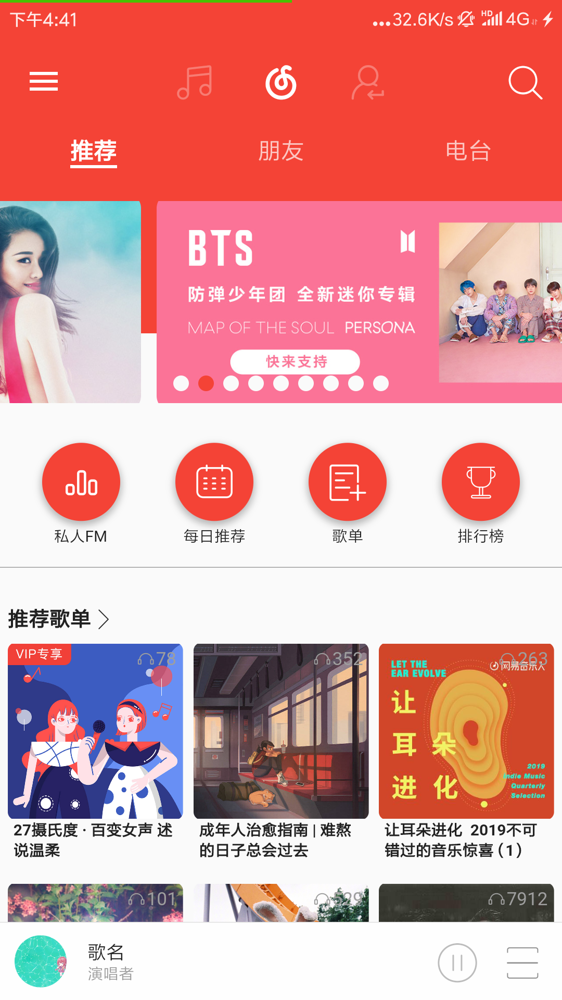

这里使用了extended_tabs插件，来解决二级导航滑动的问题，，，，，

相信写过的小伙伴知道我说的二级导航滑动的问题，这里当初自己写写了好久，我哭了.......

## 一级导航的第二页 一级导航的第二页中的第二页 个人中心

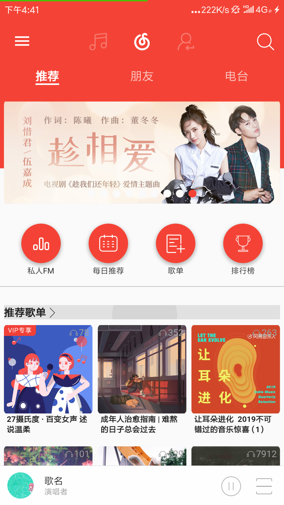
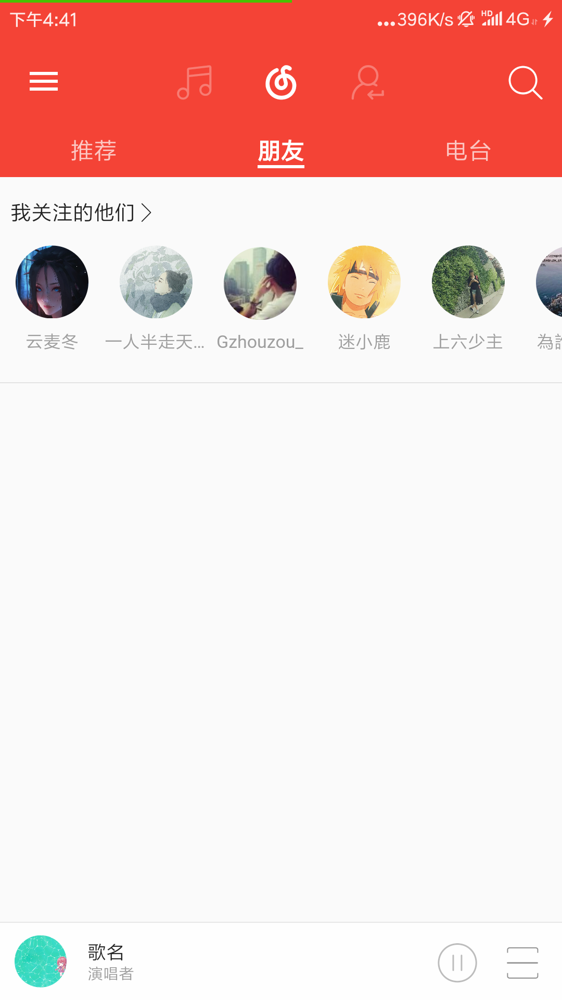
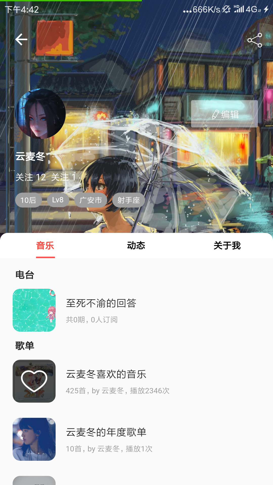

## 个人中心---展示header的变化，这里也写了超久----不过学习了sliver家族，开心

##### 好想给你们展示一下动图啊，下次补上

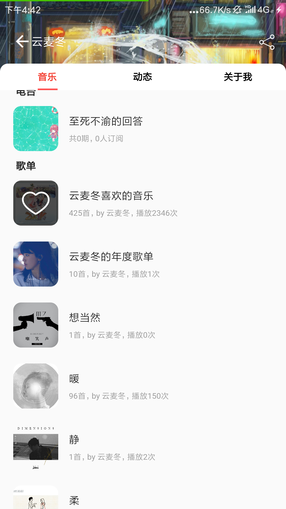

## 歌单

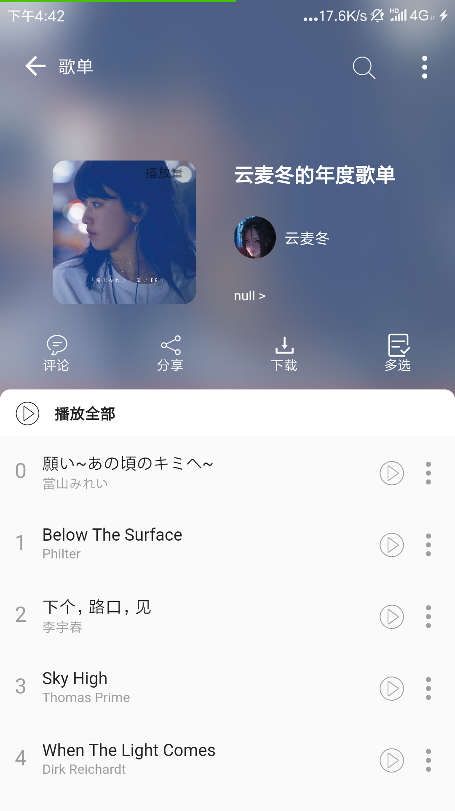

## 歌单-----这里也想给你们展示动图........

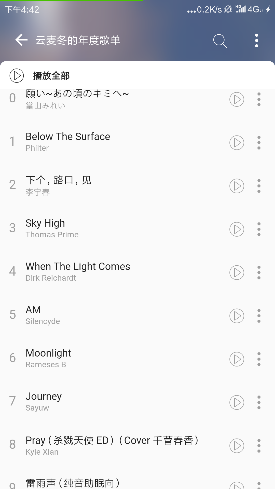

## 播放界面---

### 这里还没有写完，只写了界面-------最近学业忙---数据过两天加上

### 这里我会加上鲸云的音频波浪效果的------等我.......

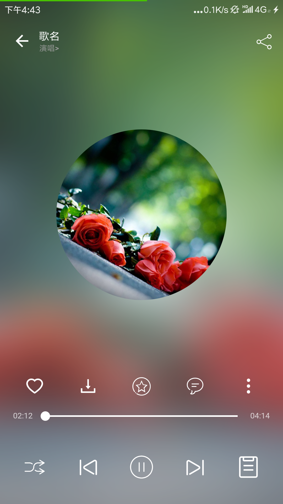

# 给我一点时间----------

# 我一定会努力的！！！！